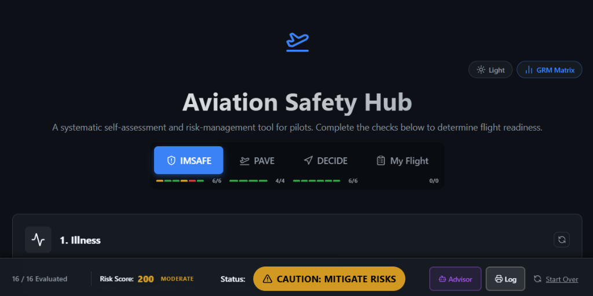
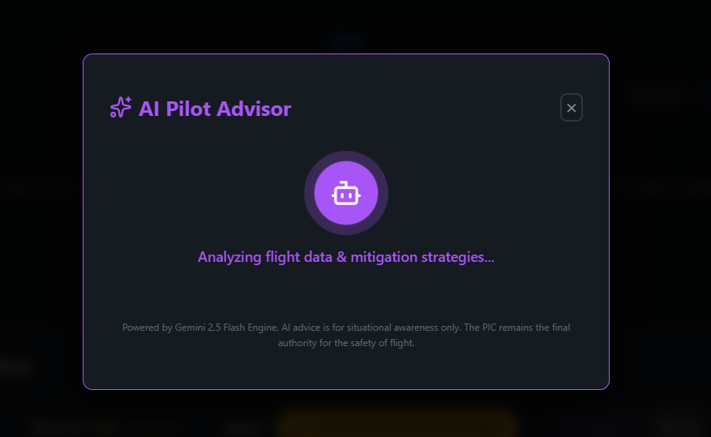
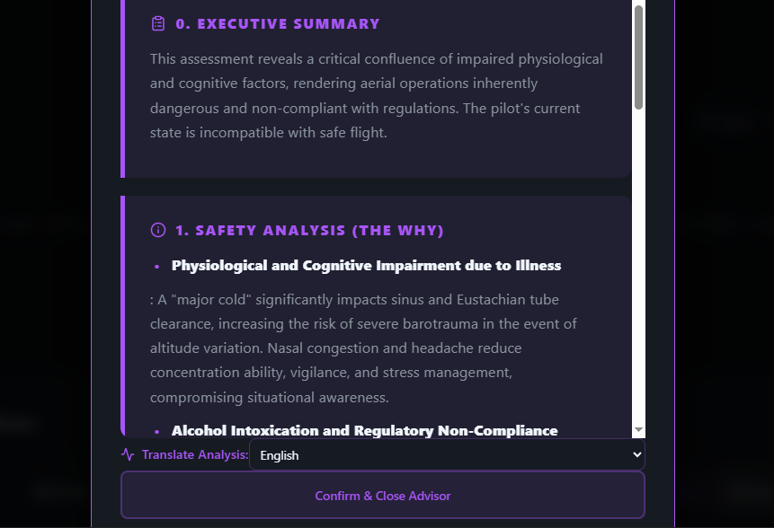
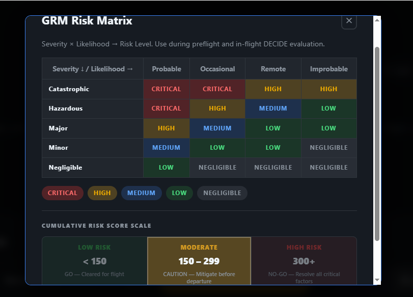
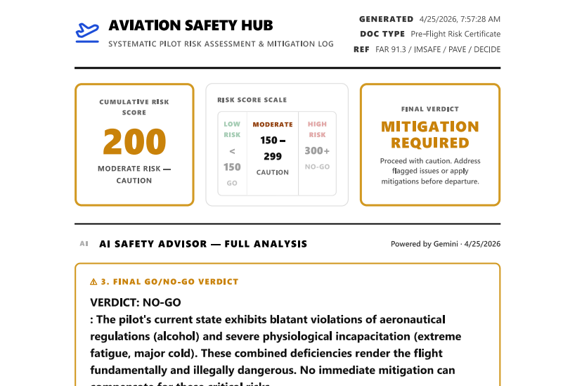

# ✈️ Aviation Safety Hub

[](https://opensource.org/licenses/MIT)
[](https://react.dev/)
[](https://www.electronjs.org/)

A professional-grade, systematic self-assessment and risk-management tool designed for pilots. **Aviation Safety Hub** streamlines the pre-flight decision-making process by integrating industry-standard safety frameworks with modern AI analysis.

---

## 🚀 Project Overview

The Aviation Safety Hub is a desktop application that helps pilots evaluate their readiness for flight. It utilizes the **IMSAFE**, **PAVE**, and **DECIDE** frameworks to calculate a cumulative risk score, identify potential hazards, and provide actionable mitigations. The standout feature is the **AI Pilot Advisor**, which uses generative AI to provide a clinical, high-density safety analysis of the pilot's specific assessment.

## 🛠️ Tech Stack

- **Frontend**: React 19 (Hooks, Context, useMemo)
- **Build Tool**: Vite 8.0
- **Desktop Wrapper**: Electron 41.2
- **Styling**: Vanilla CSS (Modern design system with glassmorphism)
- **Icons**: Lucide React
- **AI Engine**: Google Gemini 2.5 Flash (via secure IPC Proxy)
- **Persistence**: Browser LocalStorage

## 🏗️ Architecture

The application follows a **Decoupled Desktop Architecture**:

1.  **Main Process (`electron.cjs`)**: Handles system-level operations, window management, and acts as a secure proxy for AI API calls to bypass CORS restrictions.
2.  **Preload Script (`preload.cjs`)**: Establishes a secure, context-isolated bridge between the React frontend and the Electron main process.
3.  **Renderer Process (`src/`)**: A high-performance React SPA that manages the state, logic, and UI of the safety assessments.
4.  **Data Layer**: A centralized data structure (`data.js`) defines the frameworks, ensuring the assessment logic remains clean and extensible.

## ✨ Features

- **✅ Multi-Framework Assessment**: Complete IMSAFE (Pilot), PAVE (Environment), and DECIDE (Process) checklists.
- **🤖 AI Pilot Advisor**: Get personalized safety reports and "Go/No-Go" recommendations based on your actual data.
- **📊 Cumulative Risk Scoring**: Dynamic point-based system modeled after aviation stress scales.
- **🛡️ GRM Risk Matrix**: Integrated Severity vs. Likelihood matrix for real-time hazard evaluation.
- **📝 My Flight (Custom Checks)**: Add permanent or flight-specific items to your personal profile.
- **🖨️ Professional Flight Logs**: Generate clean, print-ready PDF reports of your safety assessment.
- **🌓 Adaptive UI**: Fully responsive design with high-contrast Dark and Light modes.

## 🧪 Testing

The application includes built-in logic validation:
- **Compliance Check**: Ensures all 20+ required items are evaluated before allowing log export.
- **Mitigation Validation**: Requires pilot notes for any item marked as "Caution" or "No-Go".
- **AI Consistency**: AI is programmatically instructed to respect the system's numeric risk thresholds while maintaining professional autonomy.

## 📂 Folder Structure

```text
flight-checklist/
├── src/                # React Frontend
│   ├── App.jsx         # Main Application Logic
│   ├── index.css       # Design System & Styling
│   └── data.js         # Safety Framework Definitions
├── public/             # Static Assets (Icons, etc.)
├── electron.cjs        # Electron Main Process
├── preload.cjs         # IPC Bridge Security Layer
├── package.json        # Dependencies & Build Scripts
└── .env                # API Key Configuration
```

## 💻 How to Run the Project

### Prerequisites
- Node.js (Latest LTS recommended)
- A Google Gemini API Key

### Installation
1.  **Clone the repository**:
    ```bash
    git clone https://github.com/yourusername/aviation-safety-hub.git
    cd aviation-safety-hub
    ```
2.  **Install dependencies**:
    ```bash
    npm install
    ```
3.  **Set up environment variables**:
    Create a `.env` file in the root and add your API key:
    ```env
    VITE_GEMINI_API_KEY=your_api_key_here
    ```

### Running Locally
- **Dev Server**: `npm run dev`
- **Run Desktop App**: `npm run electron`

### Building the .exe
To bundle the application for Windows:
```bash
# Run as Administrator for best results
npm run dist
```

## 🔮 Future Improvements

- [ ] **Cloud Sync**: Optional Firebase integration for cross-device flight logs.
- [ ] **Live Weather**: Automatic PAVE environment population via METAR/TAF APIs.
- [ ] **Aircraft Profiles**: Save specific Weight & Balance limits for different tail numbers.
- [ ] **Multi-language Support**: Full UI localization beyond AI translation.

## 📸 Screenshots

<p align="center">
  
  <br>
  <em>The high-density dashboard featuring the risk score and IMSAFE assessment.</em>
</p>

<p align="center">
  
  
  <br>
  <em>AI Pilot Advisor analyzing data and generating a clinical safety report.</em>
</p>

<p align="center">
  
  <br>
  <em>Integrated GRM Risk Matrix for severity and likelihood evaluation.</em>
</p>

<p align="center">
  
  <br>
  <em>Professional, print-ready Flight Risk Certificate generated by the app.</em>
</p>

## 👥 Developers

- **Abdelrhman Hesham** - [LinkedIn](https://www.linkedin.com/in/abdelrhman-hesham11/)
- **Renal H.Zamel** - [LinkedIn](https://www.linkedin.com/in/renal-zamel/)

---
*Disclaimer: This tool is for situational awareness and training purposes only. The Pilot in Command (PIC) remains the final authority for the safety of flight.*
